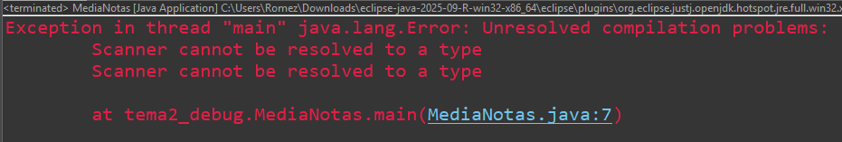
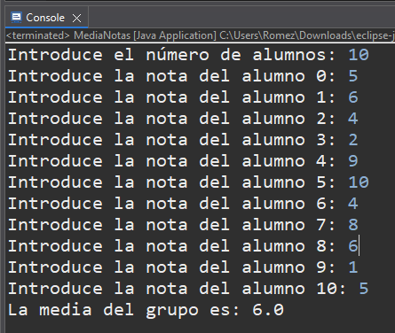

# PR-Eclipse-04-DebugProgErr

## Breakpoints colocados
Linea 16 y Linea 25

## Errores encontrados

**1. Scanner**

El objeto Scanner da error por que falta añadir el import necesario al codigo. Al añadirlo ya no da error.

**2. Contador de alumnos**

El bucle admite una nota más del numero de alumnos que introduce el usuario, hay 2 posibles formas de arreglarlo: 
1. Inicializando el contador a 1.
2. Cambiando la expresion del bucle while y quitar el igual

Por ejemplo, si el numero de alumnos es 10 dejará introducir 11 notas. Se detecta en la vista de consola.

**3. Control de errores**

El condicional if está mal escrito por lo que cuando metes un número fuera del rango especificado salta el mensaje de error en la consola pero aun así se suma el numero incorrecto a la variable suma y por consecuencia la media al final del programa es errónea y tampoco te permite volver a meter la nota correcta en ese número de alumno por que el contador se incrementa. 

Lo he detectado en el breakpoint de la linea 25, mirando la vista del debug al darme cuenta de que la variable suma cambiaba de valor.

.png)
.png)

Se corrige añadiendo las llaves correctas y su correspondiente else con la suma y el incremento del contador

.png)
.png)

## Breakpoint Condicional

.png)
.png)

## Plantilla

